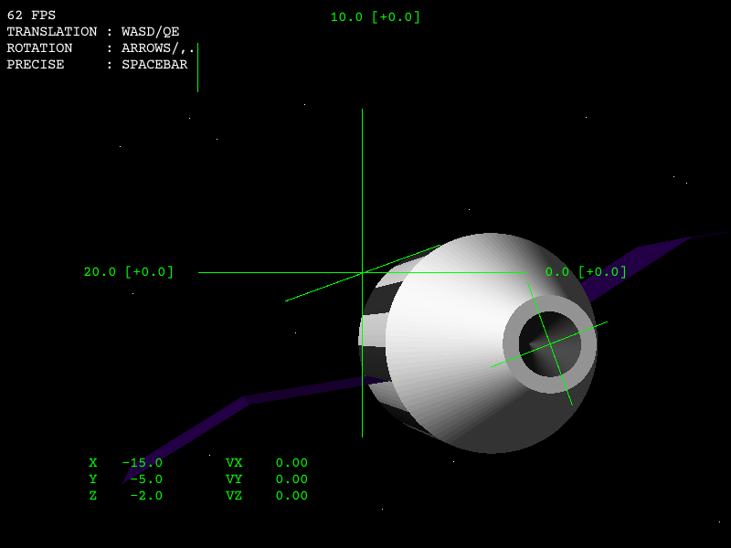

# SpaceSim
A 3D orbital rendez-vous and docking simulation made with [Umka](https://github.com/vtereshkov/umka-lang) and [Tophat](https://tophat2d.dev/). It uses a custom software renderer written in pure Umka, with Tophat as a 2D drawing backend.

[Download](https://github.com/vtereshkov/space-sim/releases)

